**SENG 438- Software Testing, Reliability, and Quality**

**Lab. Report \#5 – Software Reliability Assessment**

| Group \#:      | 27      |
| -------------- | ------- |
| Student Names: |         |
| Jared          | Assen   |
| John           | Delsing |
| Ethan          | Kerr    |
| Tyler          | Thain   |

# Introduction

#

# Assessment Using Reliability Growth Testing

## Result of the Model Comparison

Using SRTAT, we analyzed the data provided in Failure Report #2. This data had to be reformatted to be accepted by SRTAT. This reformatted data can be found in Failure_Report_2.txt in the "Lab5Data" folder. Failure Report #2 reports time-between-failure data. Of the 6 models available, only the Geometric and Littlewood-Varrel Bayesian Reliability models would run. As such, we compared the two. We would prefer the Littlewood-Varrel Bayesian Reliability model, because the Kolmogorov-Smirnov distance is smaller. That means that we are more confident that the predicted curve is representative of the same distribution from which the actual data was collected. Therefore, this model provides us a slightly better description of the SUT.

#### Table For Geometric Model:

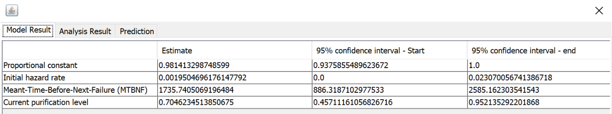

#### Table For Littlewood-Varrel Bayesian Reliability Model:

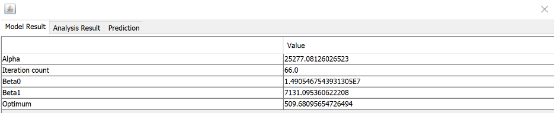

## Result of Range Analysis

In order to run these analysis models, we needed to determine what segments of the data were appropriate to consider. In order to do this, we plotted an arithmetic mean test. The arithmetic mean test indicated that the time between subsequent failures was trending upwards, and that all of the report data points followed this trend. Thus we included all of the failures in the report in our analysis.

#### Arithmetic Mean Test Graph

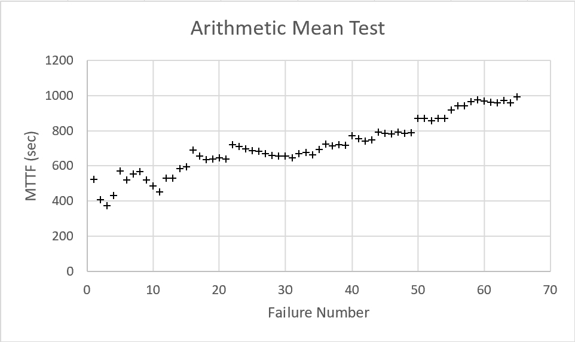

## Failure Plots for SUT Failure Data

### Time Between Failures Graphs

The time-between-failures graphs were taken from the report provided by SRTAT. Below is the time-between-failures graph for both the Geometric and Littlewood-Varrel Bayesian Reliability models. Again, as discussed above, we believe the Littlewood-Varrel Bayesian Reliability model better represents the failure characteristics of the SUT. We can see that the MTBF is trending upwards, which indicates the system is more reliable over time. That is, the longer the system runs during testing, the fewer failures it encounters per unit time.

#### Graph for Geometric Model

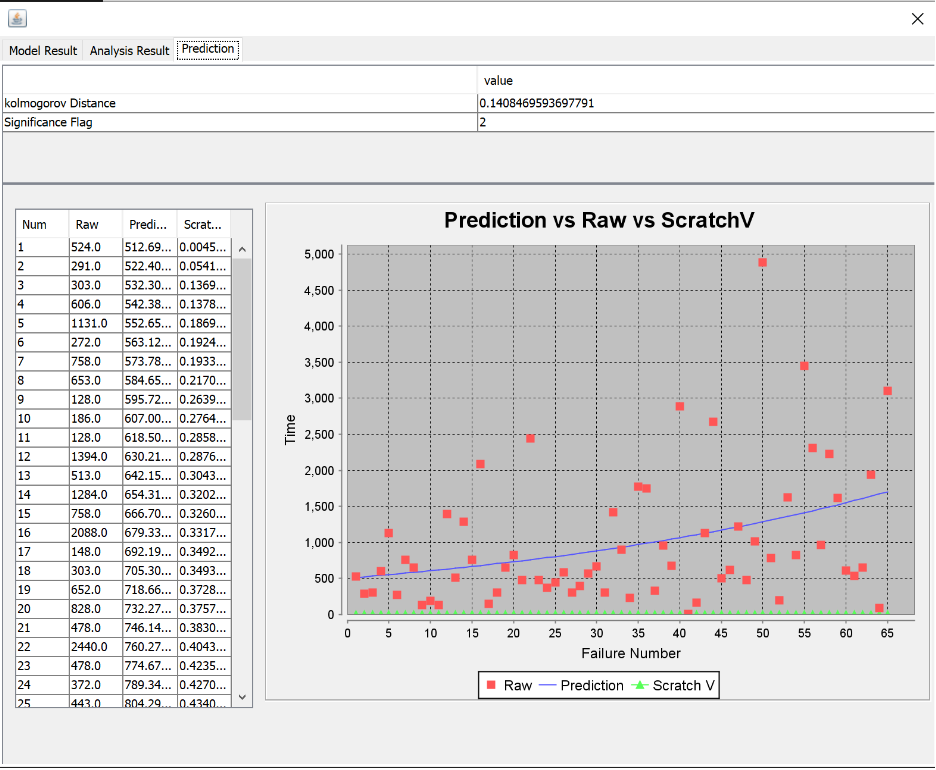

#### Graph for Littlewood-Varrel Bayesian Reliability Model

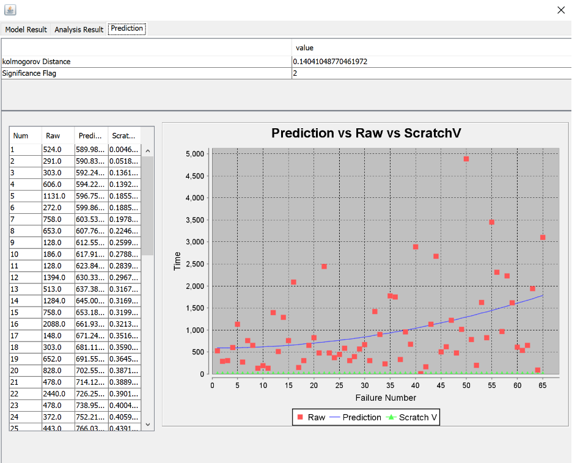

### Failure Intensity Graphs

Failure intensity graphs were plotted in Excel using the provided failure data (See "Lab5Data" folder to view the excel file). The first of these intensity graphs plots the reciprocal of time-between-failures against the cumulative time between failures (run time).

#### Failure Intensity Graph A

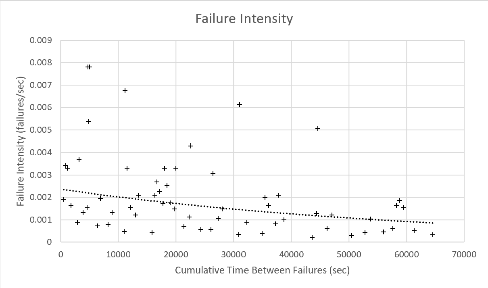

The second calculates the MTTF at each failure, and then plots the reciprocal of that failure intensity (lambda) against the cumulative time between failures (run time).

#### Failure Intensity Graph B

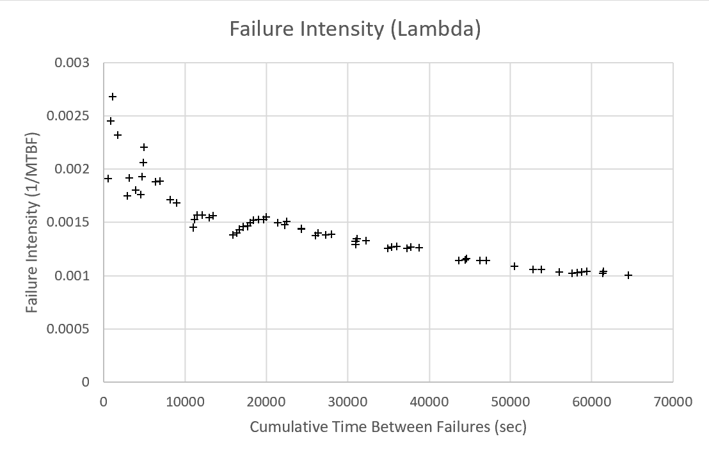

Both of these failure intensity graphs indicate a decreasing failure intensity, which again indicates that the system is more reliable over time.

### Reliability Graph

Finally, the reliability graph for the SUT was generated using the exponential reliability model, with a 100 second window of operation. Reliability for 100 seconds was graphed by calculating the MTTF at each failure, and then calculating the reliability at the failure as e^(-100/MTTF). This reliability result was then graphed against cumulative time between failures (run time), generating the below graph. As can be seen, the system reliability is growing over time, as would be expected given the results of the above analysis.

#### Reliability Graph for 100 Seconds of Operation

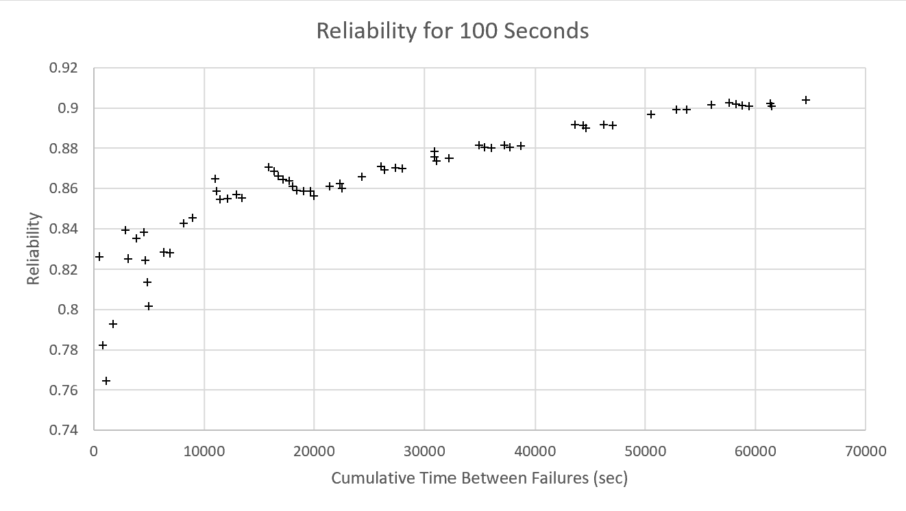

## Decision Making Given a Target Failure Rate

The Littlewood-Varrel Bayesian Reliability model gives us a mean-time-to-next-failure of around 1700s, and the Geometric model gives 1736s. This gives us a failure rate of around 5.76x10^-4 failures per second. We can compare this estimated failure rate against our target rate in order to determine whether the system is acceptable or not. This failure rate is relatively low, with about 2 failures per hour. For a mission critical system, this may be an unacceptably high rate of failure. However, for a low-stakes piece of software with low consequences in case of failure, in a system that is more resilient to failures, this may be a perfectly acceptable failure rate. This analysis will also depend on how reliable we want the system, and over what period. If we want a high degree of reliability over a longer period of time, the failure rate must be a lot lower than if we want that same degree of reliability over a longer time period. In general, we want to take the estimated failure rate from our RGT analysis, and compare it to our target rate. If the estimated failure rate is lower than the target rate, the system can be accepted. If not, further testing and debugging is required in order for the system to meet the target.

## Advantages and Disadvantages of Reliability Growth Analysis

RGA has a number of advantages. It allows one to visually understand the reliability of the characteristics of a system, and gives one a visual understanding of the response of the system to testing in terms of reliability, failure intensity, and the trend in the MTTF. Another advantage is the RGA can be performed on both time-between-failure data and failure count data. This means that RGA is flexible, and can operate on more data sets without additional manipulation of the data. Another advantage is that RGA gives us an actual estimate for MTTF, which can then be used to estimate system reliability, etc. We get a rather sophisticated analysis of the system, instead of a simple pass/fail outcome.

RGA also has disadvantages. Firstly, it requires that the data under analysis shows a trend of increasing reliability in the first place, which limits its applicability. One may have a system that fails erratically for whatever reason, and therefore makes RGA a poor choice to analyze the reliability of the SUT. Additionally, the accuracy of the analysis depends on the sample size. That is, an accurate analysis using RGA requires a large number of failures to be observed and recorded. This can become a very time-consuming process. Finally, there is a constraint on the size requirements of the SUT. Estimation results are better for SUTs with more lines of source code. This makes RGA less useful for smaller scale projects, and reduces its ability to be applied to individual modules or subsystems of a project.

# Assessment Using Reliability Demonstration Chart

Graph for MTTFmin:

the image below displaysthe plot for the MTTFmin. It was made through trail and error to develop the plot and display the reliability of the system. Our graph shows that the data is acceptable for our FIO which is 1/650, which gives a MTTF of 0.0015.
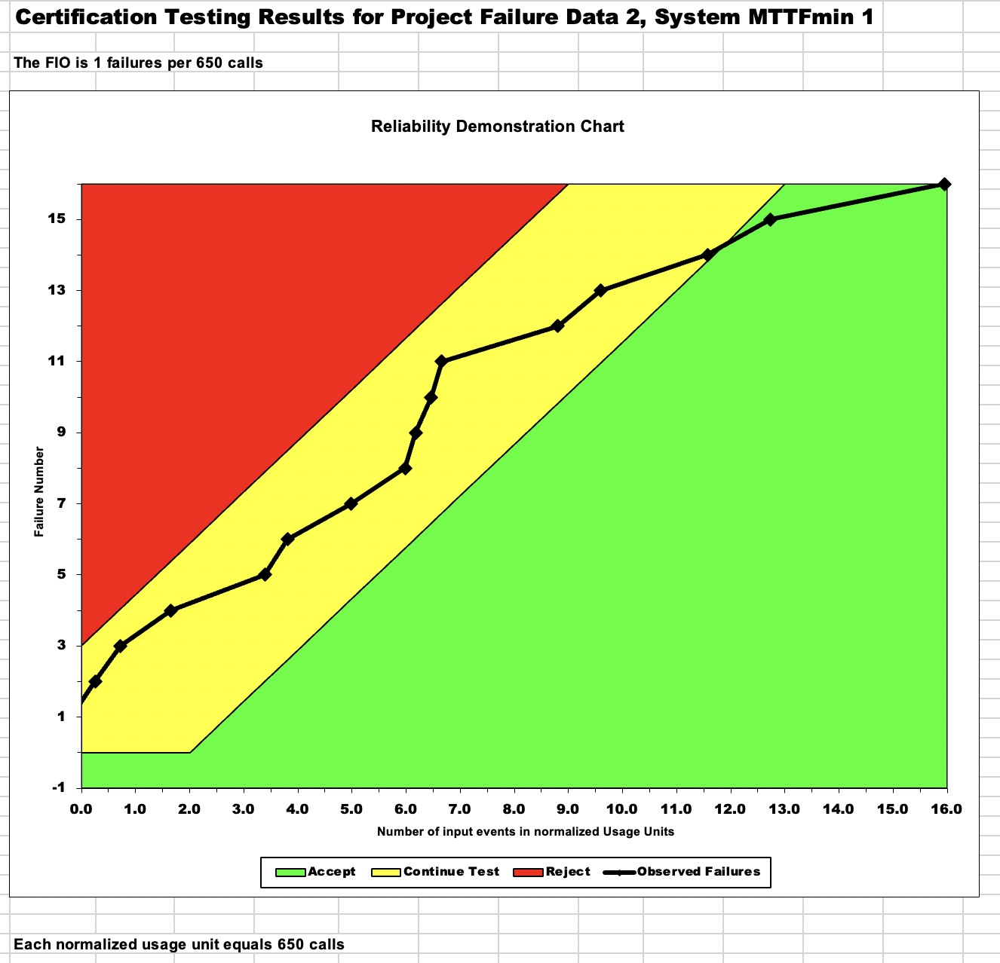

Graph for Half MTTFmin:

The graph below displays the plot for half MTTF. The updated FIO is 0.5/650, 0.00077 MTTF, and shows that the data is now rejected. This is due to the decrease in number of acceptable failures that are allowed.
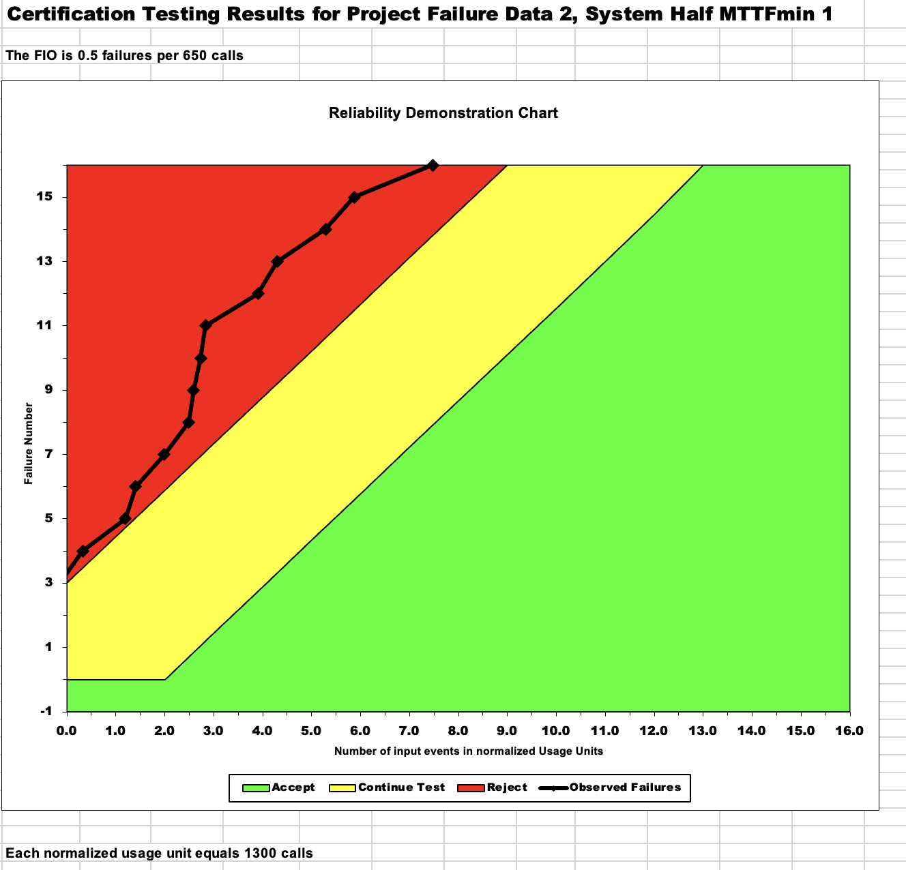

Graph for Double MTTFmin:

The graph below displays the plot for double MTTF. The updated FIO is 2/650, 0.0030 MTTF, and shows that the data trends to the accept range. This is due to the number of acceptable failures being doubled, showing more acceptable data.
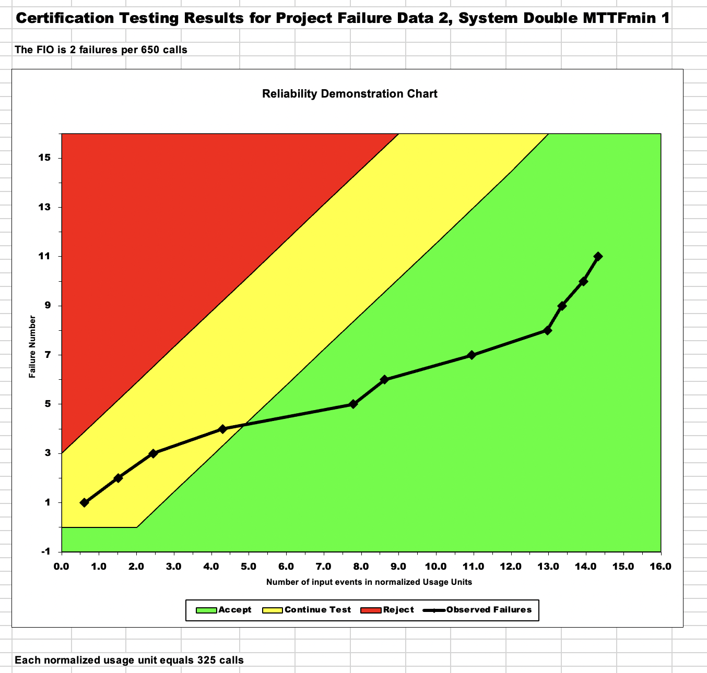

# Advantages and Disadvantages of RDC

# Comparison of Results

# Discussion on Similarity and Differences of the Two Techniques

# How the team work/effort was divided and managed

#

# Difficulties encountered, challenges overcome, and lessons learned

# Comments/feedback on the lab itself
