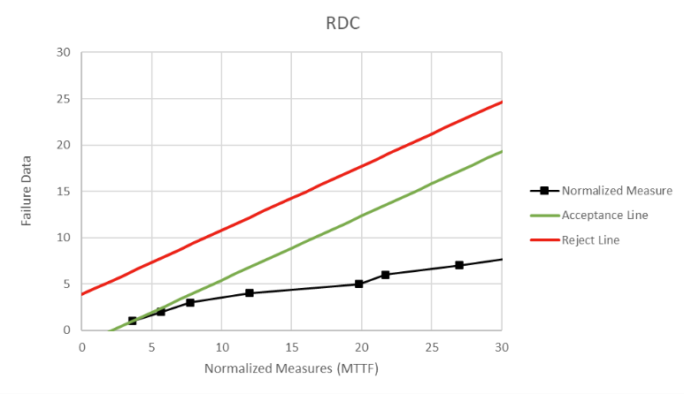

**SENG 438- Software Testing, Reliability, and Quality**

**Lab. Report \#5 – Software Reliability Assessment**

| Group \#:      | 27      |
| -------------- | ------- |
| Student Names: |         |
| Jared          | Assen   |
| John           | Delsing |
| Ethan          | Kerr    |
| Tyler          | Thain   |

# Introduction

In this lab, our group assessed failure data using reliability growth testing and reliability demonstration charts. Using these two techniques, Failure Report #2 was used to assess the reliability of a hypothetical system. SRTAT and Excel were used to create data plots of the failure data for the system under test.

#

# Assessment Using Reliability Growth Testing

## Result of the Model Comparison

Using SRTAT, we analyzed the data provided in Failure Report #2. This data had to be reformatted to be accepted by SRTAT. This reformatted data can be found in Failure_Report_2.txt in the "Lab5Data" folder. Failure Report #2 reports time-between-failure data. Of the 6 models available, only the Geometric and Littlewood-Varrel Bayesian Reliability models would run. As such, we compared the two. We would prefer the Littlewood-Varrel Bayesian Reliability model, because the Kolmogorov-Smirnov distance is smaller. That means that we are more confident that the predicted curve is representative of the same distribution from which the actual data was collected. Therefore, this model provides us a slightly better description of the SUT.

#### Table For Geometric Model:

#### Table For Littlewood-Varrel Bayesian Reliability Model:

## Result of Range Analysis

In order to run these analysis models, we needed to determine what segments of the data were appropriate to consider. In order to do this, we plotted an arithmetic mean test. The arithmetic mean test indicated that the time between subsequent failures was trending upwards, and that all of the report data points followed this trend. Thus we included all of the failures in the report in our analysis.

#### Arithmetic Mean Test Graph

## Failure Plots for SUT Failure Data

### Time Between Failures Graphs

The time-between-failures graphs were taken from the report provided by SRTAT. Below is the time-between-failures graph for both the Geometric and Littlewood-Varrel Bayesian Reliability models. Again, as discussed above, we believe the Littlewood-Varrel Bayesian Reliability model better represents the failure characteristics of the SUT. We can see that the MTBF is trending upwards, which indicates the system is more reliable over time. That is, the longer the system runs during testing, the fewer failures it encounters per unit time.

#### Graph for Geometric Model

#### Graph for Littlewood-Varrel Bayesian Reliability Model

### Failure Intensity Graphs

Failure intensity graphs were plotted in Excel using the provided failure data (See "Lab5Data" folder to view the excel file). The first of these intensity graphs plots the reciprocal of time-between-failures against the cumulative time between failures (run time).

#### Failure Intensity Graph A

The second calculates the MTTF at each failure, and then plots the reciprocal of that failure intensity (lambda) against the cumulative time between failures (run time).

#### Failure Intensity Graph B

Both of these failure intensity graphs indicate a decreasing failure intensity, which again indicates that the system is more reliable over time.

### Reliability Graph

Finally, the reliability graph for the SUT was generated using the exponential reliability model, with a 100 second window of operation. Reliability for 100 seconds was graphed by calculating the MTTF at each failure, and then calculating the reliability at the failure as e^(-100/MTTF). This reliability result was then graphed against cumulative time between failures (run time), generating the below graph. As can be seen, the system reliability is growing over time, as would be expected given the results of the above analysis.

#### Reliability Graph for 100 Seconds of Operation

## Decision Making Given a Target Failure Rate

The Littlewood-Varrel Bayesian Reliability model gives us a mean-time-to-next-failure of around 1700s, and the Geometric model gives 1736s. This gives us a failure rate of around 5.76x10^-4 failures per second. We can compare this estimated failure rate against our target rate in order to determine whether the system is acceptable or not. This failure rate is relatively low, with about 2 failures per hour. For a mission critical system, this may be an unacceptably high rate of failure. However, for a low-stakes piece of software with low consequences in case of failure, in a system that is more resilient to failures, this may be a perfectly acceptable failure rate. This analysis will also depend on how reliable we want the system, and over what period. If we want a high degree of reliability over a longer period of time, the failure rate must be a lot lower than if we want that same degree of reliability over a longer time period. In general, we want to take the estimated failure rate from our RGT analysis, and compare it to our target rate. If the estimated failure rate is lower than the target rate, the system can be accepted. If not, further testing and debugging is required in order for the system to meet the target.

## Advantages and Disadvantages of Reliability Growth Analysis

RGA has a number of advantages. It allows one to visually understand the reliability of the characteristics of a system, and gives one a visual understanding of the response of the system to testing in terms of reliability, failure intensity, and the trend in the MTTF. Another advantage is the RGA can be performed on both time-between-failure data and failure count data. This means that RGA is flexible, and can operate on more data sets without additional manipulation of the data. Another advantage is that RGA gives us an actual estimate for MTTF, which can then be used to estimate system reliability, etc. We get a rather sophisticated analysis of the system, instead of a simple pass/fail outcome.

RGA also has disadvantages. Firstly, it requires that the data under analysis shows a trend of increasing reliability in the first place, which limits its applicability. One may have a system that fails erratically for whatever reason, and therefore makes RGA a poor choice to analyze the reliability of the SUT. Additionally, the accuracy of the analysis depends on the sample size. That is, an accurate analysis using RGA requires a large number of failures to be observed and recorded. This can become a very time-consuming process. Finally, there is a constraint on the size requirements of the SUT. Estimation results are better for SUTs with more lines of source code. This makes RGA less useful for smaller scale projects, and reduces its ability to be applied to individual modules or subsystems of a project.

# Assessment Using Reliability Demonstration Chart

A model for RDC was created in excel using the equations in the Chapter 10: Reliability Assessment Tools and Techniques slide deck as SRTAT would only display one data point on its generated RDC.

## MTTFmin Plots

#### Graph for MTTFmin

This is the RDC graph with a target MTTF that puts the first failure on the boundary between accept and continue. That MTTFmin is 143.96s.

#### Graph for Half MTTFmin

This is the RDC graph with a target MTTF of MTTFmin / 2 = 71.98s.

#### Graph for Double MTTFmin

This is the RDC graph with a target MTTF of MTTFmin \* 2 = 287.92s.

## Evaluation and Justification for MTTFmin

The MTTFmin is the MTTF that places the first failure on the accept line which acts as the border between accept and continue. Therefore, the accept line formula needs to be calculated and the MTTF that places the first failure (Failure Number = 1, TBF = 524) on the accept line needs to be calculated.

### Calculations for MTTFmin

#### Accept Line

#### MTTFmin for First Failure

# Advantages and Disadvantages of RDC

RDC is a quick way to determine if the target failure rate or MTTF is met or not. By plotting the normalized failure time for each failure into accept, continue, and reject regions it is very easy to see whether an SUT meets the required failure rate or not. RDC is a good technique to use when failure data is limited to a few failures and time of failures is known. It will graphically display the trend for the reliability of the system. In this regard, RDC is very cost efficient and time efficient. It also provides the ability to conduct “what-if” analysis on different consumer risk, producer risk, target failure rate, and discrimination ratio values. The ability to easily change input risk variables allows developers to quickly analyze the reliability with different risk estimates. In this way, RDC is very versatile as it allows for both conservative and more lenient analysis.

However, RDC cannot be used to calculate the exact quantitative reliability or availability value of a system. RDC only indicates whether a system is acceptable or not so it is not advisable to use if different systems' reliability need to be compared.

# Comparison of Results

Under the risk variables we set in the RDC model, we determined that the minimum MTTF was 143.96 seconds, which is a failure rate of 0.00695 failures per second. According to this model, if we wanted an MTTF larger than this, or, equivalently, a failure intensity smaller than 0.00695 failures per second, with our risk profile and failure data, the software would no longer be acceptable. However, when we compare this to our RGT analysis, we see that our predicted MTTF is around 1700 seconds, which is significantly larger than 143.96 seconds. The RGT analysis predicts that our software is actually about 10 times better than the maximum MTTF we can support given our risk constraints. However, the RGT analysis process completely disregards these risk factors. RGT analysis is also a statistical model. If we look at the 95% confidence interval given in the Geometric model, we can see that the MTTF is at least 886 seconds with 95% confidence, which cuts our MTTF almost in half. This is where we believe some of these differences can be explained. Firstly, there is the fact that we are not accounting for developer and customer risk factors, as well as the discriminant value, when doing RGT analysis. Secondly, there are only 65 data points to work with. RDC analysis is better when the failure data is limited, and RGT analysis estimates get better with more data. Additionally, RDC analysis cannot be used to quantitatively determine the actual reliability of the system, and only indicates trends and whether the system is acceptable, which would also account for some of the discrepancy in our results. Ultimately, the RDC analysis does not provide us with the tools to directly compare the MTTF value with RGT results. However, if we look only at trends, then the two results tell us the same thing. As the system runs longer, MTTFs increase. This means that overall system reliability is increasing. Using these two models in conjunction with each other can make one doubly sure that the reliability of the system is trending in the right direction, and can help to determine if the system is at an acceptable level of reliability.

# Discussion on Similarity and Differences of the Two Techniques

Reliability Growth Testing and Reliability Demo Chart Testing are techniques employed to visualize and analyze failure data of a system. The RGT method entails analyzing reliability trends to determine the failure intensity of the system being tested, whereas the RDC method uses risk factors to decide whether the system should be accepted or rejected. While the RGT method provides a quantitative measure of a system's reliability, the RDC method only indicates if the system meets the given criteria. Nonetheless, the RDC method is more advantageous when data is limited, as the accuracy of the RGT method relies on the sample size. Another difference is the type of data that can be analyzed. The RDC method can only use time-between-failure data, while RGT can use both inter-failure times and failure count data.

# How the team work/effort was divided and managed

In this lab our group worked primarily individually as this allowed everyone to get an equal grasp of reliability analysis using the tools present. Each group member was tasked with creating the models for RGT and the three plots of RDC using the data from an agreed upon failure report. Everyone collaborated to troubleshoot various difficulties and challenges in the lab and team members helped each other out with the software and models used and created. The RGT models in the final report were created by one group member and reviewed by all the others. Another group member created the excel model for the RDC which was reviewed by all other members.

#

# Difficulties encountered, challenges overcome, and lessons learned

During this lab our group encountered a lot of difficulties with the provided software and confusing lab procedures. During the first lab time we were lost with how to get the data to run in SRTAT and even what data we needed to be running. However, with the help of the TAs, we were able to make our own data file that was formatted correctly containing the data in failure report 2. The problem then became that the software did not possess the ability to create all the graphs we needed so we were forced to create our own model in excel to make the reliability for 100 seconds and failure intensity graphs. We then ran into another problem for the RDC section with SRTAT only plotting one data point. We were also informed that the RDC-11 graph we created did not look right so we again had to create our own RDC in excel using the formulas from the chapter 10 slide deck. This lab was by far the most confusing and difficult one and we often felt like we had no idea what we were doing. However, we were able to create our own models to avoid the drawbacks of the software provided.

# Comments/feedback on the lab itself

This lab was extremely confusing and needs to be reworked. Informing the students that the data provided needed to be reformatted in a certain way would be a good start as we spent the whole first lab session with the TAs trying to figure out how to even load the data into SRTAT. The data provided is also very confusing and there is no mention of what data we should be using for our lab. The amount of provided failure reports is unnecessary and just leads to more confusion. Additionally, SRTAT does not contain the capabilities to create all the deliverables for the reliability growth testing section so a note on what to do to create the other graphs would be helpful. We also ran into an issue with SRTAT only plotting one data point for the RDC so a mention on how to fix this would have been very helpful. If this lab is left as is we believe that an in class demo of both the RDC and reliability growth testing using SRTAT should be done as we felt completely lost for most of the lab.
