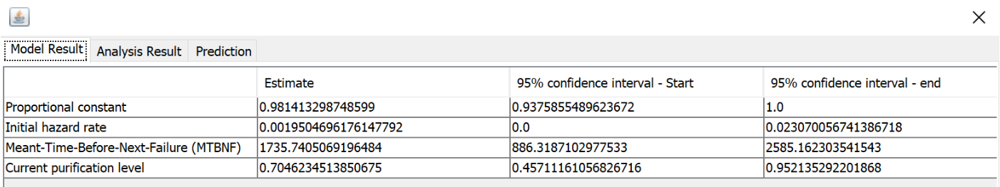
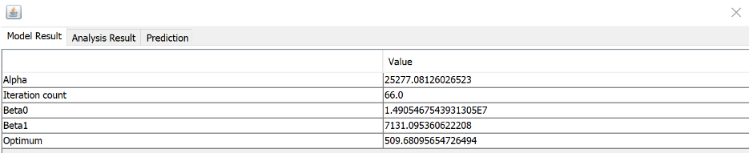
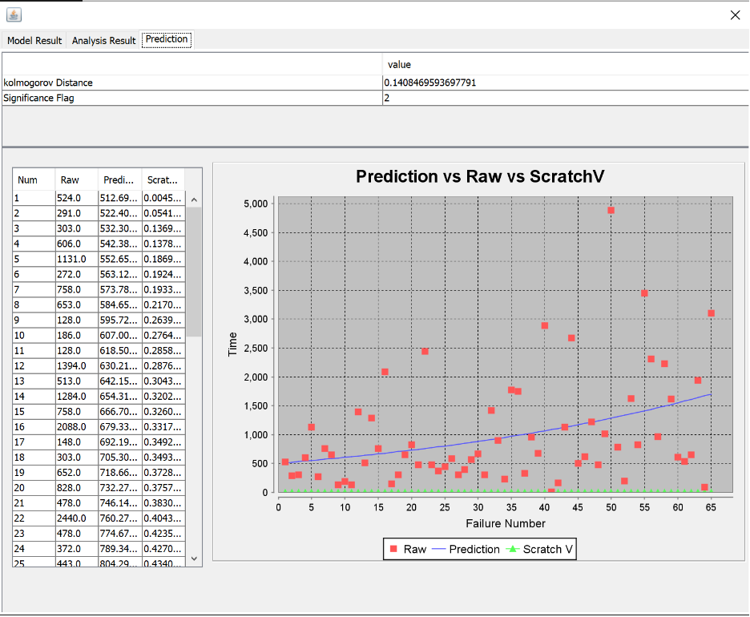
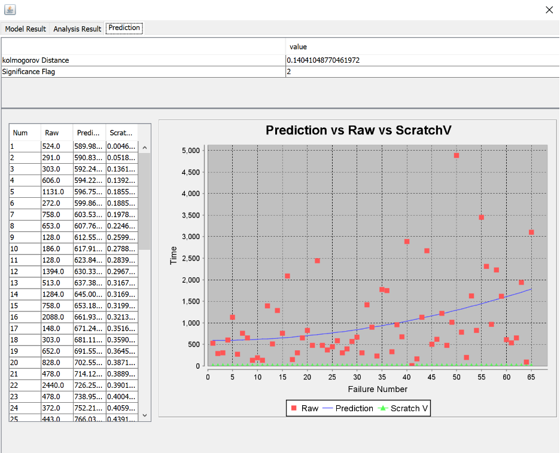

**SENG 438- Software Testing, Reliability, and Quality**

**Lab. Report \#5 – Software Reliability Assessment**

| Group \#:      | 27      |
| -------------- | ------- |
| Student Names: |         |
| Jared          | Assen   |
| John           | Delsing |
| Ethan          | Kerr    |
| Tyler          | Thain   |

# Introduction

#

# Assessment Using Reliability Growth Testing

Table For Geometric Model:

Table for Littlewood Model:

Graph For Geometric Model:

Graph For Littlewood Model:

# Assessment Using Reliability Demonstration Chart

Graph for MTTFmin:

the image below displaysthe plot for the MTTFmin. It was made through trail and error to develop the plot and display the reliability of the system. Our graph shows that the data is acceptable for our FIO which is 1/650, which gives a MTTF of 0.0015.

Graph for Half MTTFmin:

The graph below displays the plot for half MTTF. The updated FIO is 0.5/650, 0.00077 MTTF, and shows that the data is now rejected. This is due to the decrease in number of acceptable failures that are allowed.

Graph for Double MTTFmin:

The graph below displays the plot for double MTTF. The updated FIO is 2/650, 0.0030 MTTF, and shows that the data trends to the accept range. This is due to the number of acceptable failures being doubled, showing more acceptable data.

# Advantages and Disadvantages of RDC

RDC offered greater ease of use compared to C-SFRAT, with clear graphical representations of failure rates and required improvements to achieve desired MTTF. Adjusting reliability factors was also straightforward. However, determining the placement of reject, continue, and accept regions, as well as selecting an appropriate MTTF, posed challenges. Additionally, RDC did not provide data on other failure metrics, such as reliability.

# Comparison of Results

# Discussion on Similarity and Differences of the Two Techniques

# How the team work/effort was divided and managed

#

# Difficulties encountered, challenges overcome, and lessons learned

This entire lab was a struggle. There was not one aspect of the assignment where a difficulty was encountered. That said we every challenge we faced, was overcame. #personalGrowth

# Comments/feedback on the lab itself

This lab is a mess. Baffled by the amount of tools, data, and instructions that were either unclear, didn't work or just completely wrong. I would say that the assignment needs to be updated so that I can be unstood, but in reality the entire thing needs to be throw into the bin. I personally was confused from the start and could't ask any questions as the TAs also did not know how to help. 0/10
